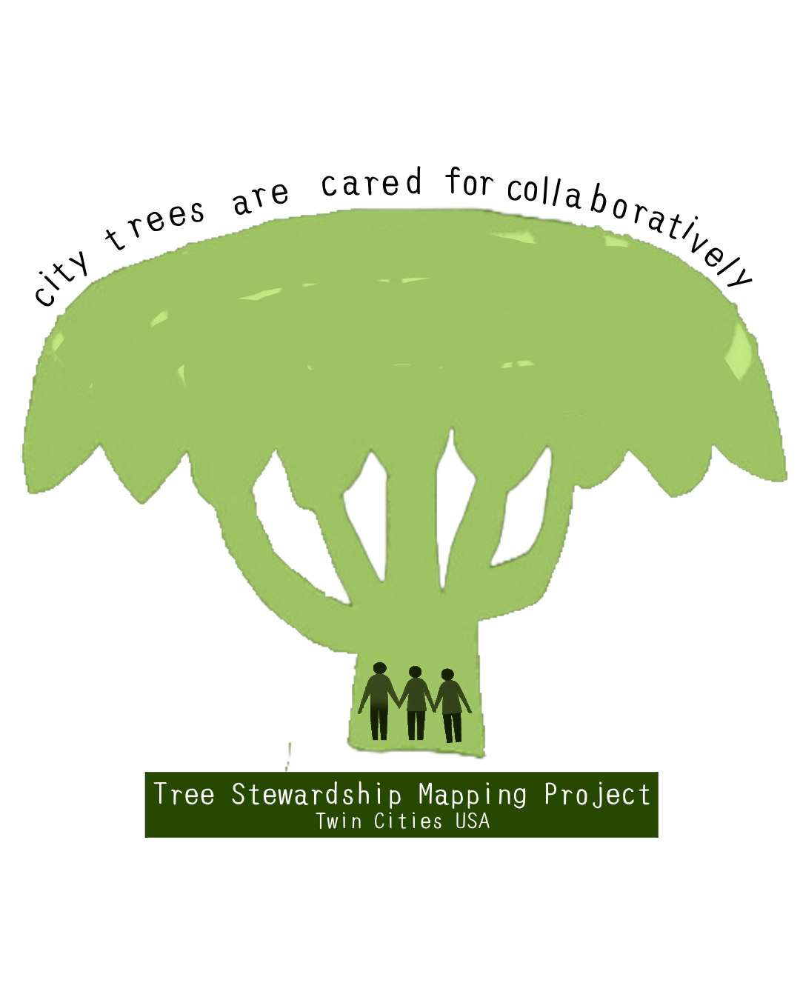

Urban trees create shade, habitat, and recreational spaces that support the well-being of urban communities. Protecting urban trees depends on the ability of many different groups to care for, or steward, trees. Yet tree stewardship varies widely across neighborhoods and cities, and we still have much to learn about how it works and where it's most effective. 

The Twin Cities Tree Stewardship Mapping Project analyzes how groups collaborate and the specific stewardship activities they perform —such as tree planting, maintenance, or advocacy— to identify opportunities for groups to coordinate more effectively, share resources, and reduce redundancy. This knowledge can highlight areas that may be underserved or ecologically vulnerable, such as neighborhoods with limited stewardship activity or declining urban forest conditions. This helps inform equitable decisions about where and how to invest in the long-term care of urban forests.

[View the map](map.html) and the [network](network.html) to learn about who cares for trees near you and how to get involved.

